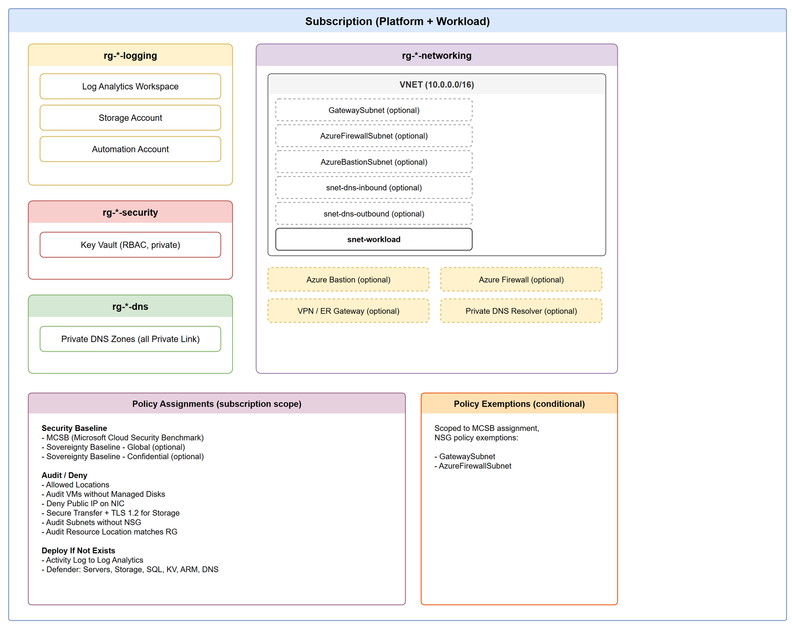

# SMB Single-Network Azure Landing Zone

An Azure Landing Zone designed for **small and medium businesses** with a limited number of workloads, managed by a **single team** within a Managed Service Provider (MSP).

Unlike enterprise ALZ designs that span multiple subscriptions and management group hierarchies — intended for large organizations with separate platform, security, and workload teams — this landing zone consolidates everything into a **single subscription** with a **single VNET**. This keeps operational overhead low while still applying Azure security baselines, policy governance, and network segmentation.

## Who is this for?

- MSPs managing SMB customers where **one team** handles platform and workloads
- Environments with a small number of workloads that don't justify a multi-subscription topology
- Organizations that want ALZ-aligned security and governance without the complexity of a full enterprise landing zone

## Architecture

**What gets deployed:**

- **Logging** — Log Analytics Workspace, Storage Account, Automation Account
- **Networking** — VNET with workload subnet, optional Bastion/Firewall/VPN/DNS Resolver
- **Security** — Key Vault (RBAC, private endpoint only)
- **DNS** — All Private Link DNS Zones linked to the VNET
- **Policy** — MCSB security baseline, ALZ audit/deny/DINE policies, optional Sovereignty Baseline
- **Policy Exemptions** — Automatic NSG exemptions for GatewaySubnet and AzureFirewallSubnet

## Implementations

This landing zone is available in both Bicep and Terraform, using Azure Verified Modules (AVM) where available.

| Implementation | Directory | Details |
|----------------|-----------|---------|
| **Bicep** | [`bicep/platform/`](bicep/platform/) | Uses `br/public:avm/...` registry modules |
| **Terraform** | [`tf/platform/`](tf/platform/) | Uses `Azure/avm-.../azurerm` registry modules |

Both implementations deploy the same architecture and are functionally equivalent. Pick whichever matches your team's tooling.

## Getting Started

1. Choose your implementation (Bicep or Terraform)
2. Read the README in that directory
3. Edit the parameter/variable file for your environment
4. Deploy
